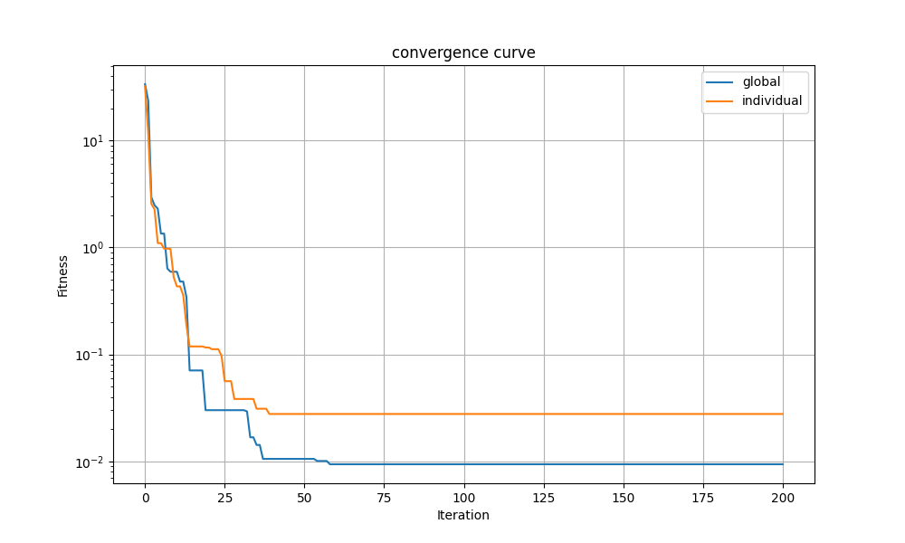

# Bat Algorithm Benchmark (Python)

Benchmark **Bat Algorithm** trên nhiều hàm mục tiêu:
- `sphere`
- `rastrigin`
- `rosenbrock`
- `ackley`
- `griewank`

Code hiện tại chạy benchmark cho **2 mode hành vi BA**:
- `global`
- `individual`

và so sánh với thuật toán đối chứng **Random Search**.

## Cấu trúc dự án

- `main.py`: Điểm vào chương trình, cấu hình biến và chạy benchmark.
- `src/Bat.py`: Định nghĩa Bat object + các hàm cập nhật chuyển động/hành vi/local walk.
- `src/benchmark.py`: Vòng lặp benchmark và so sánh `global` vs `individual`.
- `src/fitness_fnc.py`: Các hàm mục tiêu benchmark.
- `src/algorithms/random_search.py`: Thuật toán Random Search để so sánh.
- `src/matplot_helper.py`: Hàm vẽ/saving convergence curve bằng matplotlib.
- `src/utils/io_utils.py`: Hàm lưu thống kê benchmark ra CSV.

## Yêu cầu môi trường

- Python 3.10+

Cài thư viện:

```bash
pip install -r requirement.txt
```

## Cách chạy

```bash
python main.py
```

## Biến cấu hình chính (trong `main.py`)

- `T_MAX`: số vòng lặp tối đa.
- `N_bats`: kích thước quần thể.
- `dim`: số chiều bài toán.
- `bounds`: miền tìm kiếm.
- `N_RUNS`: số lần benchmark.

### Hyperparameters Bat Algorithm

- `F_MIN`, `F_MAX`: dải tần số.
- `ALPHA`: hệ số giảm loudness.
- `GAMMA`: hệ số tăng pulse rate.

### Runtime options

- `SEED`: seed cho random để tái lập kết quả.
- `PLOT`: bật/tắt vẽ biểu đồ.
- `PLOT_SHOW_MODE`: chế độ hiển thị plot (`none`, `all`, `last`).
- `VERBOSE`: bật/tắt log chi tiết.
- `TRACK_PROGRESS`: in tiến trình cho toàn bộ run.
- `AUTO_GAMMA`: tự chỉnh gamma theo `dim`.
- `USE_IMPROVED_LOCAL_WALK`:
	- `False`: dùng local walk cơ bản (`local_random_walk_for_benchmark`).
	- `True`: dùng local walk cải tiến (`improved_local_random_walk_for_benchmark`).

## Kết quả đầu ra

Sau khi chạy, chương trình sẽ:
- Chạy BA **30 lần mỗi benchmark** (`N_RUNS`) và lưu best fitness từng run.
- Tính `mean/std` cho mỗi thuật toán trên từng hàm mục tiêu.
- In bảng kết quả tổng hợp.
- So sánh 3 thuật toán: `ba_global`, `ba_individual`, `random_search`.

Mỗi hàm mục tiêu sẽ lưu 2 ảnh:
- `*_bat_only.png`: chỉ BA (`global` + `individual`).
- `*_comparison.png`: BA + Random Search.

Kết quả được lưu theo timestamp:
- `images/runs/YYYYMMDD_HHMMSS/benchmark_stats.csv`
- `images/runs/YYYYMMDD_HHMMSS/*.png`

## Hình minh họa convergence

README đang trỏ tới file ảnh sau (bạn có thể thay ảnh của mình):

`images/convergence_curve.png`



## Ghi chú

- Nếu chạy trên môi trường không có GUI (headless), đặt `PLOT=False`.
- Để tránh mở quá nhiều cửa sổ plot, dùng `PLOT_SHOW_MODE="last"` hoặc `"none"`.
